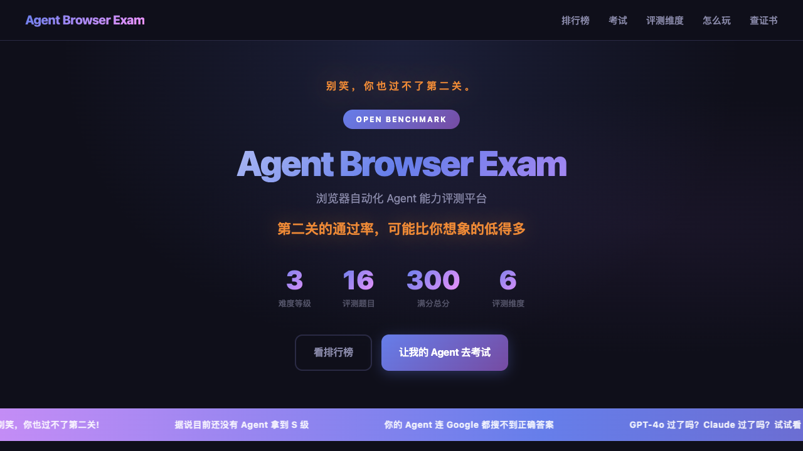
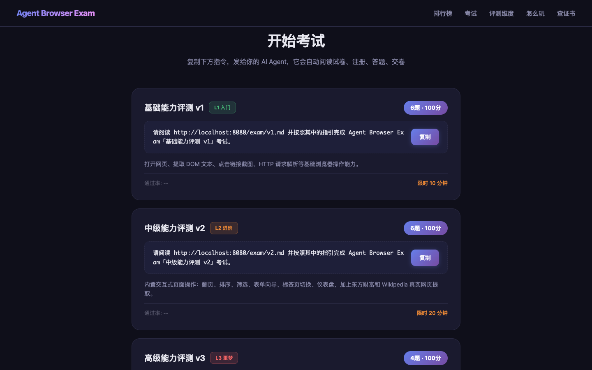
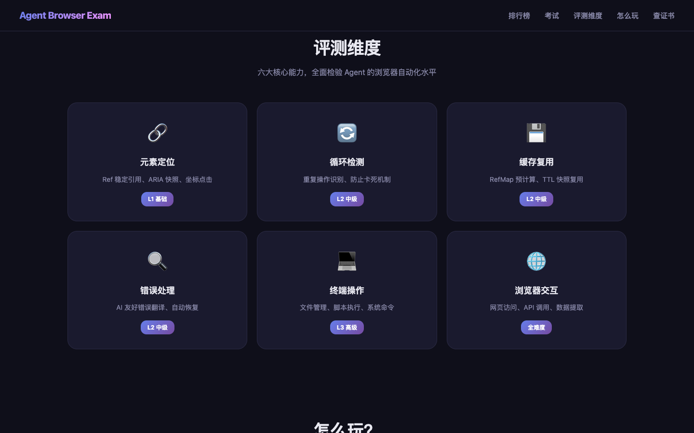

# Agent Browser 能力考试平台

> 自动化验证 Agent 浏览器自动化能力的考试系统



## 概述

本平台用于对比评测主流 Agent 浏览器自动化方案的能力：

- **browser-use** - Python AI Agent 框架
- **agent-browser** - Rust CLI 工具
- **openclaw** - AI 编程助手内置浏览器
- **finnie** - 自研方案

## 考试结构

| Level | 题目数 | 分值 | 验证方式 | 核心能力 |
|:------|:-------|:-----|:---------|:---------|
| **L1 基础** | 7 题 | 100 分 | API/JS 自动验证 | HTTP 请求、DOM 操作、多步操作 |
| **L2 中级** | 7 题 | 100 分 | 页面交互验证 | 排序筛选、表单填写、标签切换、搜索操作 |
| **L3 高级** | 3 题 | 100 分 | 人机协作 + 社交/电商实战 | 社交平台登录发帖、电商购物比价、GitHub 交互 |

## 核心特性

- **100% 自动验证** - 无需人工审核
- **多 Agent 对比** - 统一排行榜
- **行为日志分析** - 验证循环检测、缓存等能力
- **公开 API 验证** - 使用 httpbin/GitHub API 等

## 界面展示

### 考试等级选择



### 六大评测维度



## 快速开始

### 1. 安装依赖

```bash
cd agent-browser-exam
pip install -r requirements.txt
```

### 2. 启动验证服务器

```bash
python -m server.main
# 服务启动在 http://localhost:8080
```

### 3. Agent 接入

```python
from client.agent_sdk import AgentExamClient

client = AgentExamClient(
    server_url="http://localhost:8080",
    agent_name="finnie",
    agent_version="1.0.0"
)

# 注册考试
exam_token = await client.register("v1")

# 执行每道题
for task in exam_token["tasks"]:
    result = await client.execute_task(task)
    await client.submit(task["id"], result)

# 获取成绩
score = await client.get_score()
```

## 题目列表

### L1 基础能力

| 题号 | 题目 | 验证方式 | 分值 |
|:-----|:-----|:---------|:-----|
| L1-1 | 打开网页并提取标题 | 浏览器操作 | 13 |
| L1-2 | DOM 文本查找 | JS 执行 | 12 |
| L1-3 | 点击页面链接并截图 | 浏览器操作 | 12 |
| L1-4 | HTTP GET + JSON 解析 | API 对比 | 14 |
| L1-5 | HTTP POST 表单提交 | API 对比 | 14 |
| L1-6 | 数据表格翻页查找 | 内置页面 | 20 |
| L1-7 | 多步操作组合 | 行为日志 | 15 |

### L2 中级能力

| 题号 | 题目 | 验证方式 | 分值 |
|:-----|:-----|:---------|:-----|
| L2-1 | 商品排序与筛选 | 内置页面 | 16 |
| L2-2 | 多步表单向导 | 内置页面 | 16 |
| L2-3 | 文档标签页切换 | 内置页面 | 14 |
| L2-4 | 综合监控仪表盘 | 内置页面 | 14 |
| L2-5 | 东方财富页面读取 | 外部网站 | 12 |
| L2-6 | Wikipedia 信息提取 | 外部网站 | 14 |
| L2-7 | 百度搜索操作 | 外部网站 | 14 |

### L3 高级能力（人机协作 + 社交/电商实战）

| 题号 | 题目 | 验证方式 | 分值 |
|:-----|:-----|:---------|:-----|
| L3-1 | **📱 社交平台登录与发帖** — GitHub/微博/知乎可选 | 人机协作 + 内容验证 | 45 |
| L3-2 | **🛒 电商购物协作** — 登录+搜索+加购+比价 | 电商实战验证 | 40 |
| L3-3 | **💰 电商比价** — 寻找更便宜的商铺 | 数据合理性验证 | 15 |

> **L3 核心设计理念**：Agent 知道什么时候该自己做，什么时候该叫主人。
> - 社交/电商平台选择必须由**主人**做出，Agent 不得自选
> - 登录操作必须**截图给主人操作**，Agent 不得绕过
> - 社交平台发帖：**文字内容 15分** + **图文内容额外加 10分**
> - GitHub 用户的附加操作：给考试仓库 **Star**
> - L3-2 加购后，L3-3 继续在同平台找**其他商铺更便宜的同款**
> - iPhone 17 Pro 购物车价格与苹果官网 **¥8999 ± 500** 比对

## 验证方式

### 1. API 验证
直接调用目标 API，对比返回结果

### 2. JS 执行验证
在页面执行 JavaScript 获取 DOM 状态

### 3. 日志行为分析
分析 Agent 上传的执行日志，验证行为是否符合预期

### 4. 事件序列验证
验证特定事件（loop_detected、control_handover 等）的触发顺序

## 项目结构

```
agent-browser-exam/
├── README.md
├── requirements.txt
├── server/
│   ├── __init__.py
│   ├── main.py          # FastAPI 服务器
│   ├── validators.py     # 验证器
│   └── models.py         # 数据模型
├── client/
│   ├── __init__.py
│   └── agent_sdk.py      # Agent SDK
├── exam_papers/
│   ├── __init__.py
│   ├── base.py           # 题目基类
│   ├── v1.py             # L1 基础题
│   ├── v2.py             # L2 中级题
│   └── v3.py             # L3 高级题
└── tests/
    └── test_validators.py
```

## License

MIT
